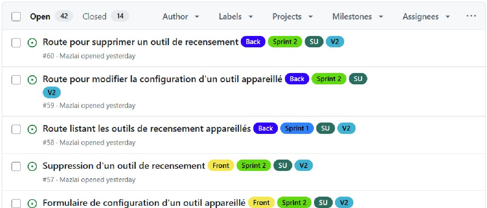
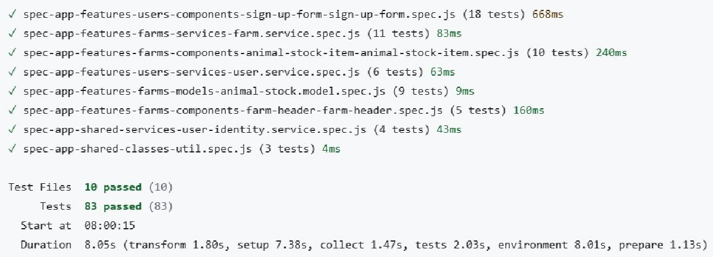
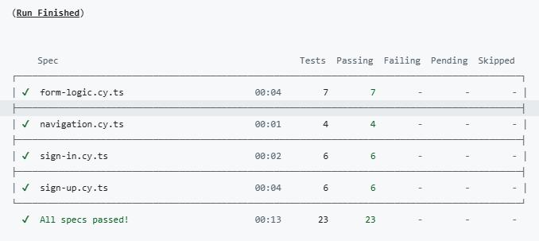
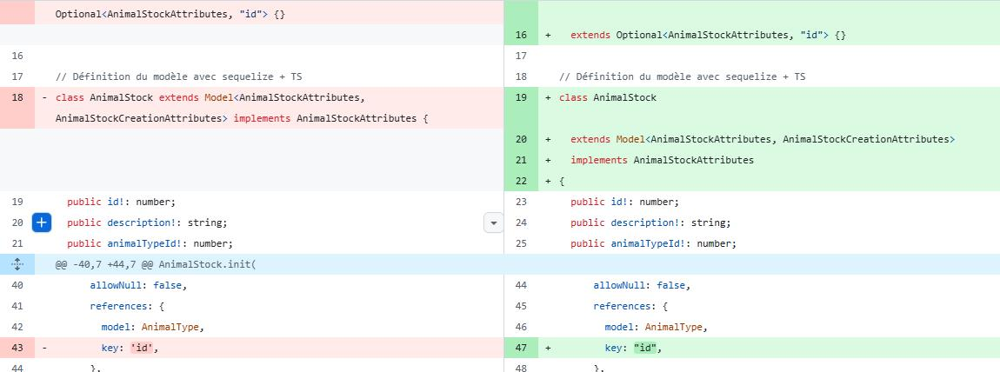
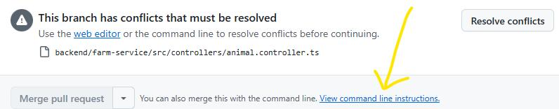
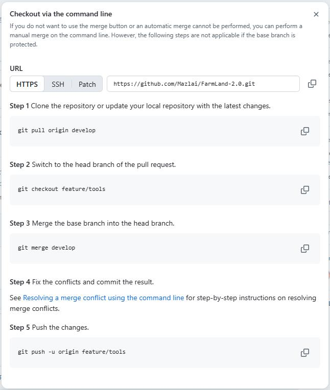

= Guide de contribution
:icons: font
:toc: macro
:toc-title: Table des matières
:toclevels: 4
:sectnums:

Ce document détaille des informations et les processus à respecter pour contribuer au projet à partir de ce repository GitHub.

toc::[]

== Issues GitHub

Les tâches tournant autour du projet sont suivies au travers d'issues GitHub. Il est possible d'ouvrir une issue GitHub en tant que feature à implémenter ou bug à corriger.

WARNING: Seules les issues taggées `V2` correspondent à FarmLand 2.0 et sont à prendre en compte. Les issues taggées `V1` correspondent à la version 1.0 existante de l'application et n'ont été créées qu'à titre indicatif.

Un projet GitHub a été mis en place avec des boards permettant de suivre plus facilement l'avancement de chaque tâche (voir document link:GOVERNANCE.adoc["GOVERNANCE"]).

== Stratégie de branches
Le projet adopte une stratégie de branches inspirée du modèle GitFlow. Elle permet de structurer le développement, sécuriser les mises en production et garantir une collaboration efficace entre les développeurs.

=== Nommage des branches
Les branches respectent les conventions suivantes :

* `main` : Contient la dernière version stable de l’application en production.
Chaque merge sur cette branche correspond à une release officielle et est
associé à un tag de version.
* `develop` : Branche d’intégration principale.
Elle contient la version stable en cours de développement.
* `feature/xxx` : Branche dédiée au développement d’une fonctionnalité. Créée à partir de `develop`.
* `feature/SU/xxx` : Sous-branche permettant de développer un scénario utilisateur spécifique lié à une feature.
* `release/xxx` : Branche utilisée pour préparer une nouvelle version de l'application (stabilisation, corrections mineures, versioning).
* `hotfix/xxx` : Branche dédiée aux correctifs urgents sur une version en production.

=== Process / workflows mis en place et à respecter
Pour développer une nouvelle fonctionnalité, apporter un correctif ou faire une release d'une nouvelle version de l'application, suivre les processus décrits ci-dessous.

==== Branche de feature et de scénario utilisateur

. Prendre une issue existante ou ouvrir une issue en se basant sur le template dédié aux features
. Créer une branche à partir de l'issue (et à partir de la branche `develop`)
. Si nécessaire, créer des sous-branches `feature/SU/xxx` implémentant les scénarios utilisateurs spécifiques à la feature
. Une fois un scénario utilisateur terminé et validé -> Merge sur la branche `feature/xxx` correspondante *via une Pull Request*
. Une fois l'implémentation de la feature terminée -> Valider le code en <<test_linting,lançant les tests et le code linting>>
. Une fois la feature complète terminée et validée -> Merge sur la branche `develop` *via une Pull request*
+
WARNING: Avant de merge une Pull Request sur une branche `feature/xxx` ou sur la branche `develop`, vérifier que l'issue correspondant au scénario utilisateur ou à la feature est bien associée à la Pull Request.
. Une fois la Pull Request fusionnée, la branche de la feature sera supprimée et l'issue associée fermée (et marquée comme "Done" dans les boards du projet GitHub)

Les commits effectués sur des branches feature doivent respecter le format `Feature: <message>` et ceux effectués sur la branche d'un scénario utilisateur, le format `SU: <message>`.

WARNING: La branche `develop` doit tout le temps contenir une version stable du code. Un ruleset et des actions GitHub ont été mis en place afin que le seul moyen de pousser du code sur cette branche soit en passant par des Pull Requests à partir de branches feature.

==== Branche de release

. Lorsque toutes les features prévues sur le sprint sont terminées et merge dans `develop` -> Une branche `release/xxx` peut être créée depuis `develop`
. Dans le fichier `package.json` à la racine de chaque projet frontend et backend, remplacer la valeur `development` du paramètre `environment` par `production`
. Une fois la branche prête -> Merge sur la branche `main` *via une Pull Request* et créer un tag correspondant <<version_no,au numéro de la version>>
. Une fois la Pull Request fusionnée, la branche de la release sera supprimée et une 'build prototype' du frontend de l'application sera déployé sur le <<github_pages,GitHub Pages du repo>> du projet
. Merge en retour `main` dans `develop` afin de conserver l’historique et les correctifs

Les commits effectués sur des branches release doivent respecter le format `Release: x.x.x`.

WARNING: La branche `main` doit tout le temps contenir une version complète, taggée et stable de l'application. Un ruleset et des actions GitHub ont été mis en place afin que le seul moyen de pousser du code sur cette branche soit en passer par des Pull Requests à partir de branches release ou hotfix.

===== Numéro de version [[version_no]]
Pour la release d'une nouvelle version de l'application, suivre l'exemple et les explications ci-dessous.

*Exemple :*

Version `1.4.2` de l'application :

* `1` : version (majeure) de l'application -> ne change que si un lot majeur d'évolutions est apporté à l'application
* `4` : numéro d'évolution -> ne change que lorsque des petites évolutions sont apportées à l'application
* `2` : numéros de correctif -> change à chaque fois qu'un correctif est apporté à l'application

==== Branche de correctif

. Prendre une issue existante ou ouvrir une issue en se basant sur le template dédié aux retours de bugs
. Créer une branche `hotfix/xxx` depuis la branche `main`
. Associer toutes les issues à prendre en compte dans le correctif à la branche
. Une fois l'implémentation du correctif terminée -> Valider le code en <<test_linting,lançant les tests et le code linting>>
. Une fois le correctif terminé et validé, suivre les étapes pour effectuer une release en partant de la branche du correctif plutôt que de `develop`
+
WARNING: Avant de merge une Pull Request sur la branche `develop`, vérifier que l'issue correspondant au scénario utilisateur ou à la feature est bien associée à la Pull Request.
. Une fois la Pull Request fusionnée, la branche du correctif sera supprimée et les issues associées fermées (et marquées comme "Done" dans les boards du projet GitHub)

Les commits effectués sur des branches release doivent respecter le format `Fix: <message>`.

=== Commandes à privilégier
Utiliser des commandes Git classiques (add, commit, push, etc)

Privilégier les Pull Requests pour merge les branches entre elles.

Éviter les rebases, reset hard ou toute autre manipulation qui pourrait nuire à la cohérence et à la continuité de l'historique des commits.

== Migrations et seeders Sequelize

L'ORM https://sequelize.org/[Sequelize] permet de simplifier la mise en place et le versioning des bases de données ainsi que de consolider leur cohérence avec les modèles de données manipulés par les micro-services backend.

Pour appliquer les dernières migrations à une base de données, exécuter la commande suivante à la racine du projet du service correspondant :

[source, bash]
----
npx sequelize-cli db:migrate
----

Sequelize permet également l'automatisation du remplissage des bases de données via des fichiers "seeders".

Pour exécuter les derniers seeders et remplir une base de données, exécuter la commande suivante à la racine du projet du service correspondant :

[source, bash]
----
npx sequelize-cli db:seed:all
----

NOTE: Voir la https://sequelize.org/docs/v7/cli/#running-seeds[documentation de Sequelize] pour les autres commandes permettant la gestion et le versioning des migrations et des seeders.

== Tests et code linting [[test_linting]]

Des tests ainsi qu'un code linting sont automatiquement exécutés lors de la création d'une Pull Request vers les branches 'develop' et 'main' afin d'attester que seul du code stable est poussé sur ces dernières. Si les tests ne passent pas ou que des erreurs sont repérées lors du code linting, la Pull Request ne sera pas acceptée.

=== Tests frontend

==== Tests unitaires

Des tests unitaires ont été ajoutés pour le projet frontend dans des fichiers `<composant>.spec.ts` afin de vérifier le bon fonctionnement des logiques implémentées dans l'interface utilisateur.

Les tests unitaires peuvent être lancés manuellement en exécutant la commande suivante à la racine du projet frontend :

[source, bash]
----
npm run test
----

==== Tests end-to-end

Des tests de bout-en-bout (end-to-end) ont également été implémentés avec https://www.cypress.io/[Cypress] afin de vérifier le bon fonctionnement de l'interface utilisateur en simulant des parcours d'utilisateurs automatisés.

Les tests end-to-end peuvent être lancés manuellement en exécutant la commande suivante à la racine du projet frontend :

[source, bash]
----
npm run e2e
----

=== Code linting

Le code linting mis en place permet avant tout de vérifier la stabilité et la qualité du code poussé en soulevant des erreurs si des problèmes de compilation sont trouvées ou si du code est jugé comme pas suffisamment maintenable. Le code linting permet également de formatter le code poussé selon les paramétrages définis pour un rendu plus homogène (des espaces et des retours à la ligne sont ajoutés ou enlevés, certains caractères sont remplacés, etc).

Un code linting peut être lancé manuellement en exécutant la commande suivante à la racine du projet frontend ou à celle d'un des micro-services backend :

[source, bash]
----
npm run lint
----

== GitHub Pages [[github_pages]]

À chaque nouvelle release de l'application sur la branche 'main', une 'build prototype' de l'interface frontend de l'application est déployée sur le GitHub Pages du repo de FarmLand 2.0, accessible à l'adresse https://mazlai.github.io/FarmLand-2.0.

== Gestion des conflits

Si des conflits sont rencontrés lors du merge d'une branche dans une autre via une Pull Request, suivre les étapes de résolution par lignes de commande comme indiqué sur GitHub en cliquant sur "View command line instructions" dans la page de la Pull Request correspondante.

Pour l'étape 4, une fois les conflits résolus sur votre poste, nommer le commit du correctif en respectant le format `conflict: merge '<source branche name>' into '<target branch name>'`.