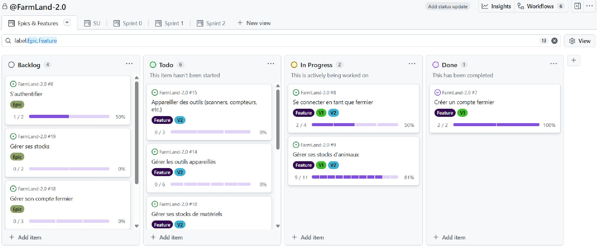
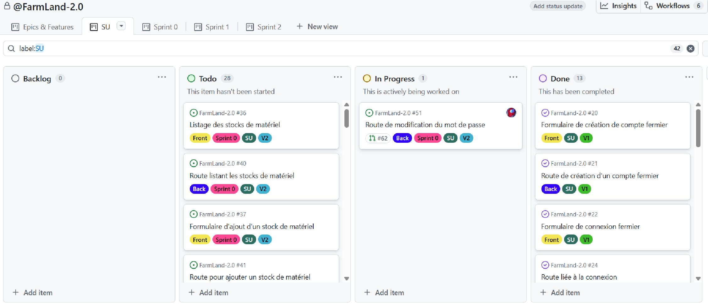
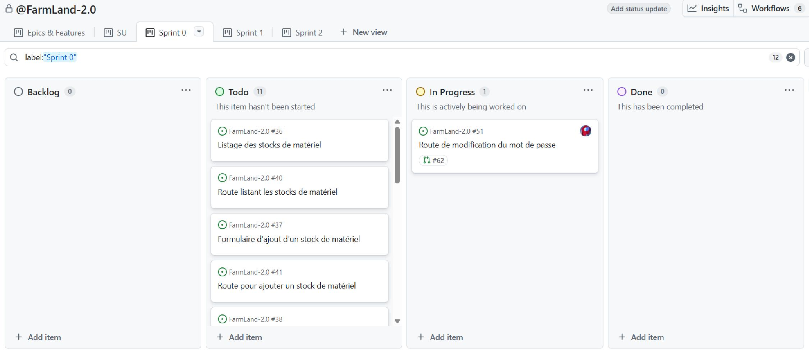

= Gouvernance du repo
:icons: font
:toc: macro
:toc-title: Table des matières
:toclevels: 2
:sectnums:

Le repo est géré par https://github.com/Mazlai[Mickael "Mazlai" FERNANDEZ]. À contacter pour toute demande particulière ou complainte.

toc::[]

== Organisation des boards
Plusieurs boards ont été mis en place dans le projet GitHub de FarmLand afin de proposer des vues adaptées aux différents niveaux de granularité du projet et ainsi faciliter la gestion des tâches et leur avancée. Chaque board repose sur des filtres spécifiques permettant d'organiser l'information de manière pertinente.

=== Board "Epic / Features"

Ce board regroupe les issues possédant le label `epic` ou `feature`. Il permet d'obtenir une vision macro du produit et de ses évolutions.

* *Epic*
Un epic correspond à une grande brique fonctionnelle du produit. Il regroupe plusieurs fonctionnalités cohérentes et s’inscrit généralement sur une longue temporalité.

* *Feature*
Une feature représente une fonctionnalité concrète apportant une valeur
utilisateur.
Elle est généralement rattachée à un epic et peut être découpée en scénarios
utilisateurs.

Ce board permet :

* De visualiser la roadmap produit,
* D’identifier les grandes priorités,
* De suivre l’avancement global des fonctionnalités,
* De comprendre la structuration fonctionnelle du projet.

=== Board "SU" (Scénarios utilisateurs)

Ce board recense les issues de type scénario utilisateur (SU), généralement
rattachées à une feature.

Les issues présentes dans ce board possèdent un label spécifique (ex: `SU`)
et sont liées à une issue feature via la relation parent/enfant.

Il permet :

* De visualiser le découpage fonctionnel détaillé,
* De suivre l’avancement opérationnel des développements,
* De faciliter la répartition du travail,
* D’améliorer la traçabilité entre besoin métier et implémentation.

=== Boards de sprint

Des boards dédiés aux sprints (Sprint 0, Sprint 1, Sprint 2, etc.)
permettent de suivre les issues planifiées pour chaque itération.

Chaque board applique un filtre basé sur le champ sprint associé aux issues.

Ces boards permettent :

* De visualiser le contenu d’un sprint,
* De suivre la progression des tâches (To do, In progress, Done),
* D’identifier rapidement les blocages,
* De faciliter les rituels agiles (daily, review, retrospective).

