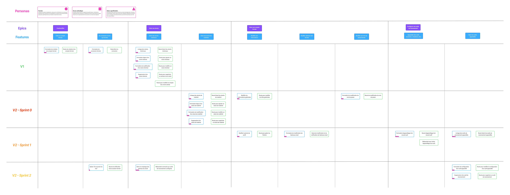
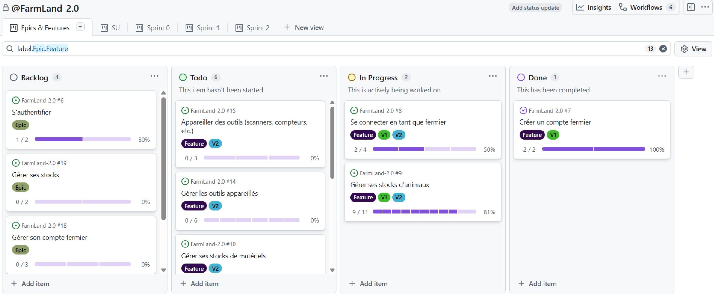
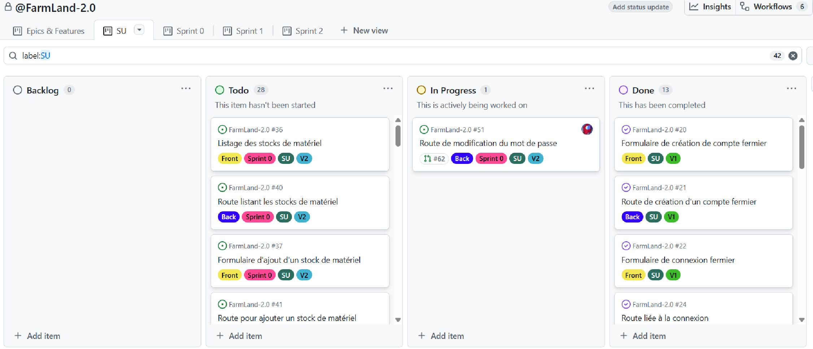
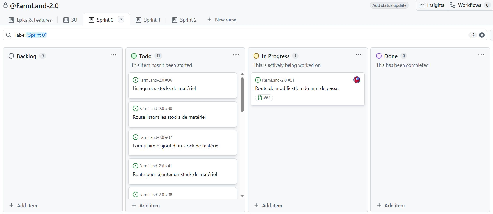

= Gouvernance du repo
:icons: font
:toc: macro
:toc-title: Table des matières
:toclevels: 3
:sectnums:

Le repo est géré par https://github.com/Mazlai[Mickael "Mazlai" FERNANDEZ]. À contacter pour toute demande particulière ou complainte.

toc::[]

== Storymap

Une storymap a été réalisée afin de bénéficier d'une vue d'ensemble de tous les scénarios utilisateur à implémenter pour chaque feature selon les différents personas remontés.

=== Personas

Les personas suivants ressortent dans la storymap et doivent être pris en compte dans l'implémentation des scénarios utilisateurs.

==== Fermier

Utilisateur de base de l’application, doit pouvoir se familiariser et se retrouver facilement avec l’interface afin de bénéficier au maximum des fonctionnalités proposées spécifiquement pour faciliter le travail des fermiers.

==== Écran cathodique

Utilisateur ayant accès à un appareil de qualité basse. L’interface de l’application devra prendre en compte des couleurs ressortantes et mettre l’accent sur la responsivité afin de convenir à un maximum de supports.

==== Stats / gamification

Petit joueur ayant besoin de s’amuser au travers de l’application. Certaines fonctionnalités comme celles concernant l’utilisation d’appareils connectés pour le comptage automatisé d’animaux pourront être pensées pour être davantage ludiques.

=== Répartition des scénarios utilisateur

Les scénarios utilisateur sont répartis dans la storymap en sprites pour chaque feature spécifiée. Les formes apparaissant sur certains des scénarios utilisateurs font référence aux personas correspondants.

== Organisation des boards
Plusieurs boards ont été mis en place dans le projet GitHub de FarmLand afin de proposer des vues adaptées aux différents niveaux de granularité du projet et ainsi faciliter la gestion des tâches et leur avancée. Chaque board repose sur des filtres spécifiques permettant d'organiser l'information de manière pertinente.

=== Board "Epic / Features"

Ce board regroupe les issues possédant le label `epic` ou `feature`. Il permet d'obtenir une vision macro du produit et de ses évolutions.

* *Epic*
Un epic correspond à une grande brique fonctionnelle du produit. Il regroupe plusieurs fonctionnalités cohérentes et s’inscrit généralement sur une longue temporalité.

* *Feature*
Une feature représente une fonctionnalité concrète apportant une valeur
utilisateur.
Elle est généralement rattachée à un epic et peut être découpée en scénarios
utilisateurs.

Ce board permet :

* De visualiser la roadmap produit,
* D’identifier les grandes priorités,
* De suivre l’avancement global des fonctionnalités,
* De comprendre la structuration fonctionnelle du projet.

=== Board "SU" (Scénarios utilisateurs)

Ce board recense les issues de type scénario utilisateur (SU), généralement
rattachées à une feature.

Les issues présentes dans ce board possèdent un label spécifique (ex: `SU`)
et sont liées à une issue feature via la relation parent/enfant.

Il permet :

* De visualiser le découpage fonctionnel détaillé,
* De suivre l’avancement opérationnel des développements,
* De faciliter la répartition du travail,
* D’améliorer la traçabilité entre besoin métier et implémentation.

=== Boards de sprint

Des boards dédiés aux sprints (Sprint 0, Sprint 1, Sprint 2, etc.)
permettent de suivre les issues planifiées pour chaque itération.

Chaque board applique un filtre basé sur le champ sprint associé aux issues.

Ces boards permettent :

* De visualiser le contenu d’un sprint,
* De suivre la progression des tâches (To do, In progress, Done),
* D’identifier rapidement les blocages,
* De faciliter les rituels agiles (daily, review, retrospective).

