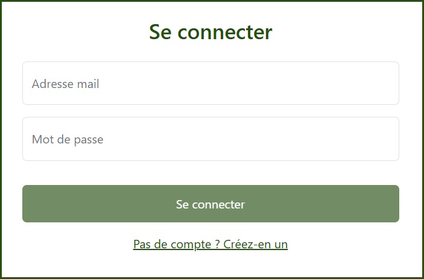
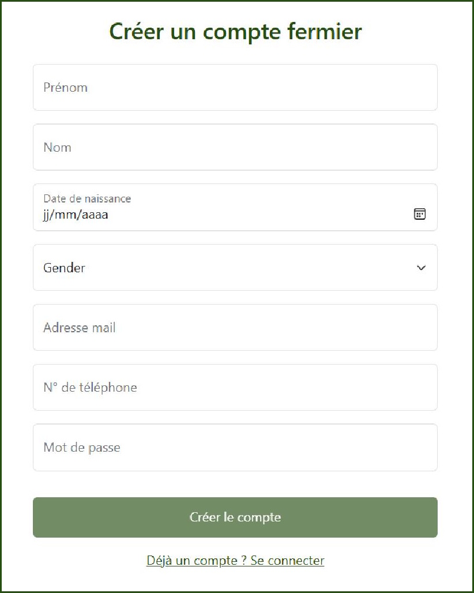
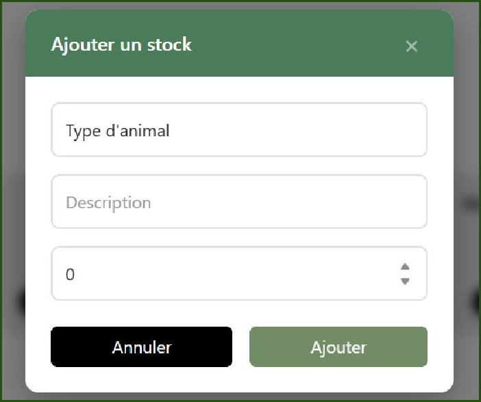
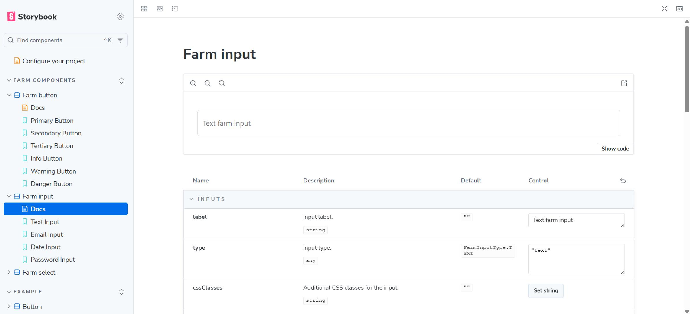
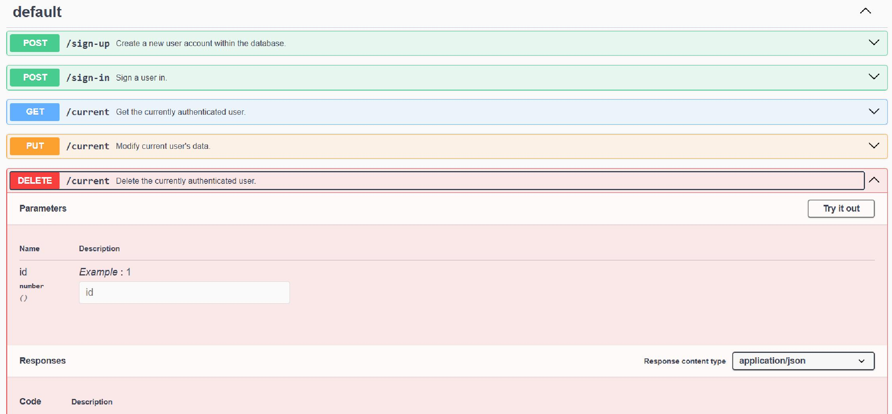

= FarmLand 2.0
:icons: font
:toc: macro
:toclevels: 3
:toc-title: Table des matières
:sectnums:

FarmLand (2.0) est une application web encourageant la transition numérique auprès des fermiers en proposant une solution clé en main facilitant la gestion de stocks d’animaux et de matériel.

toc::[]

== FarmLand
La plateforme FarmLand permet aux agriculteurs de créer facilement un compte et de suivre en temps réel, leurs stocks d’animaux et de matériels à partir de n’importe quel appareil (ordinateur, tablette ou smartphone). Dans sa version 2.0, l'application offre également la possibilité de connecter des outils de recensement tels que des scanners, détecteurs ou compteurs automatiques pour faciliter le processus de comptage auprès des fermiers.

=== FarmLand 1.0
Une première version de FarmLand a déjà été développée afin de poser les fondations du projet et de valider les besoins essentiels du terrain. Cette version initiale se concentre sur un périmètre fonctionnel restreint, intégrant les fonctionnalités de base suivantes :

* *L’authentification* : Un compte fermier peut être créé via la page dédiée à gauche. Les utilisateurs disposant d’un compte fermier peuvent se connecter avec leur adresse email et leur mot de passe à droite.

* *La gestion de stocks d’animaux* : Une fois connecté, la page de gestion de stocks d’animaux permet aux fermiers de consulter la liste complète de ses stocks d’animaux, d’ajouter, de modifier ou de supprimer les stocks d’animaux.

image::images/v1/v1_stocks.jpg[,650]

== Structure

L'application existante est basée sur une architecture micro-services :

image::images/architecture.png[,650]

* `frontend/`: interface frontend basée sur https://angular.dev[Angular]
* `backend/`: micro-services backend
** `user-service/`: micro-service de gestion des utilisateurs (et de l'authentification) basé sur https://expressjs.com/[Express] et https://sequelize.org/[Sequelize] (database ORM)
** `farm-service/`: micro-service de gestion des fermes basé sur https://expressjs.com/[Express] et https://sequelize.org/[Sequelize] (ORM base de données)
** `api_gateway/`: serveur proxy gérant les redirections entre l'interface frontend et les micro-services backend, basé sur https://expressjs.com/[Express] et https://www.npmjs.com/package/http-proxy-middleware[http-proxy-middleware] (experimental)

== Installation et prérequis

FarmLand se base sur un environnement Node.js et PostgreSQL.

=== Installation des dépendances

. Installer la dernière version de https://nodejs.org/[Node.js]
. Exécuter la commande suivante dans un terminal à la racine du projet pour installer les dépendances de chaque composant de l'application:
+
[source,bash]
----
npm i
----
. Installer la dernière version de https://www.docker.com/[Docker] pour faciliter le lancement de l'application

=== Fichier environnement

Des fichiers `.env.dev` doivent être ajoutés à la racine du dossier des micro-services de gestion des link:backend/user-service/[utilisateurs] et des link:backend/farm-service/[fermes]. Ces fichiers peuvent être créés à partir des fichiers `.env` existant (à ne pas modifier) à ces mêmes emplacements.

Renseigner des valeurs pour chaque variable d'environnement définie dans les fichiers `.env.dev`. Utiliser les valeurs définies dans les fichiers `docker-compose.yml` rattachés aux micro-services si l'application est lancée dans des <<docker,conteneurs Docker>>.

== Lancement via NPM

Les composants de l'application peuvent être lancés individuellement via des commandes NPM.

WARNING: Seules les application frontend et backend peuvent être lancées via des commandes NPM, il sera nécessaire de trouver un hébergeur local pour les bases de données ainsi qu'un SGBDR adapté.

=== Lancement de l'interface frontend
Exécuter la commande suivante link:frontend/[à la racine du projet de l'interface frontend] pour lancer ce dernier :

[source, bash]
----
npm start
----

=== Lancement de l'API utilisateur
Exécuter la commande suivante link:backend/user-service/[à la racine du projet du backend utilisateur] pour lancer ce dernier :

[source, bash]
----
npm run dev
----

=== Lancement de l'API ferme
Exécuter la commande suivante link:backend/farm-service/[à la racine du projet du backend ferme] pour lancer ce dernier :

[source, bash]
----
npm run dev
----

=== Lancement du serveur proxy
Exécuter la commande suivante link:backend/api-gateway/[à la racine du projet du serveur proxi] pour lancer ce dernier :

[source, bash]
----
npm run dev
----

== Lancement via Docker [[docker]]

Chaque composant de l'application est rattaché à des fichiers `Dockerfile` et `docker-compose.yml` permettant de les lancer dans des conteneurs Docker distincts.

=== Créer le réseau Docker de l'application

Bien que chaque composant puisse être lancé séparément dans un conteneur Docker, pour communiquer entre eux, un réseau Docker doit être créé.

Créer le réseau `farmland_network` en lançant la commande suivante dans un terminal :

[source, bash]
----
docker network create farmland_network
----

=== Lancer les conteneurs Docker

==== Lancer un conteneur individuellement

Exécuter la commande suivante dans un terminal à la racine d'un composant de l'application pour le lancer dans un conteneur Docker :

[source,bash]
----
docker-compose up -d --build
----

[WARNING]
====
L'erreur suivante peut apparaitre en lancer l'interface frontend Angular dans un conteneur :

image::images/angular_app_container_error.png[]

Si cela arrive, essayer de lancer la commande suivante https://docs.docker.com/reference/cli/docker/container/exec/[à l'intérieur du conteneur correspondant] :

[source, bash]
----
npm i
----

Relancer après coup le conteneur.

====

==== Lancer tous les conteneurs

Exécuter la commande suivante dans un terminal à la racine du projet pour lancer tous les composants de l'application à l'intérieur de conteneurs Docker :

[source,bash]
----
cd frontend
docker-compose -p farmland_frontend up -d --build

cd ../backend/user-service
docker-compose -p farmland_user_backend up -d --build

cd ../farm-service
docker-compose -p farmland_farm_backend up -d --build

cd ../api-gateway
docker-compose -p farmland_api_gateway up -d --build
----

NOTE: https://docs.docker.com/desktop/[Docker Desktop] peut être téléchargé pour gérer plus facilement les conteneurs Docker créés.

==== Accéder aux conteneurs

Each component can be accessed at the following addresses:

Chaque composant de l'application peut être accédées à partir des adresses suivantes :

* Application principale : http://localhost:3000
* Interface frontend : http://localhost:4200
* Backend:
** Backend utilisateur :
*** API utilisateur : http://localhost:3001
*** Base de données utilisateur : http://localhost:5432
*** Interface pgAdmin de gestion de la base de données utilisateur: http://localhost:8888
** Backend ferme:
*** API ferme : http://localhost:3002
*** Base de données ferme : http://localhost:5431
*** Interface pgAdmin de gestion de la base de données ferme : http://localhost:8887

NOTE: Une fois lancé, un conteneur peut prendre quelques instants à s'initialiser avant d'être accessible à l'adresse correspondante.

=== Populer les bases de données

Des scripts sont mis à disposition pour populer les bases de données de gestion des utilisateurs et des fermes avec des données factices afin d'effectuer des tests rapides.

Exécuter la commande suivante à l'intérieur du dossier `src/` à l'intérieur du conteneur Docker supportant le backend utilisateur afin de populer la base de données des utilisateurs :

[source, bash]
-----
node -r ts-node/register --env-file=../.env.dev seedUsers.ts
-----

Faire la même chose avec la commande suivante dans le conteneur supportant le backend des fermes pour populer base de données des fermes :

[source, bash]
-----
node -r ts-node/register --env-file=../.env.dev seedAnimals.ts
-----

== Documentation et tests

=== Interface storybook

https://storybook.js.org/[Storybook] a été ajouté au projet frontend de l'application afin de documenter et de faciliter le test les différents composants Angular implémentés.

Exécuter la commande suivante à la racine du projet frontend pour lancer l'interface Storybook :

[source, bash]
----
npm run storybook
----

=== Documentation backend avec Swagger

https://swagger.io/[Swagger] a été ajouté aux projets backend de gestion des utilisateurs et des fermes afin de documenter et de faciliter le test des différentes routes implémentées.

La page Swagger de l'API des utilisateurs peut être accédée à l'adresse http://localhost:3001/docs et celle de l'API des fermes à l'adresse http://localhost:3002/docs.

=== Codes d'erreurs HTTP

Tous les codes d'erreur HTTP sont référencés et expliqués https://developer.mozilla.org/en-US/docs/Web/HTTP/Reference/Status[ici].