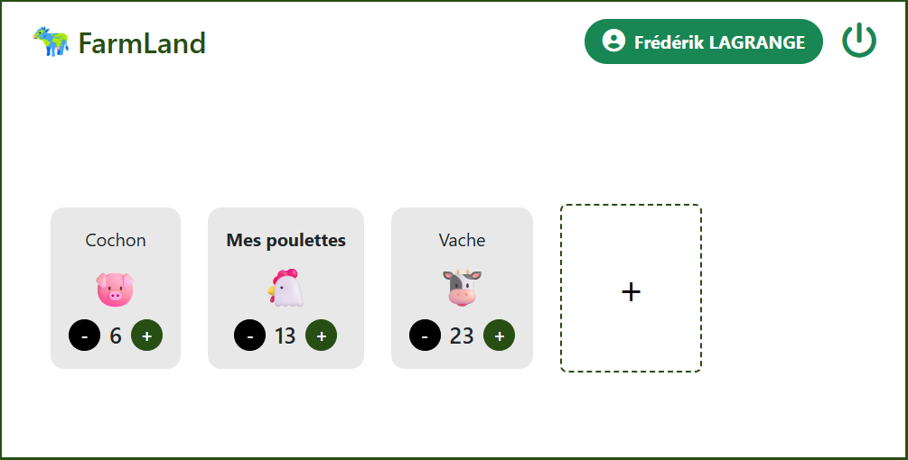
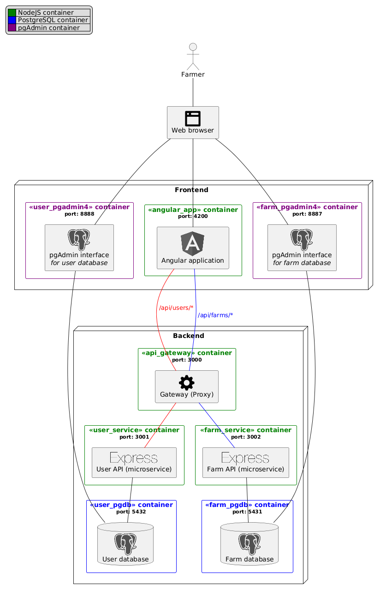
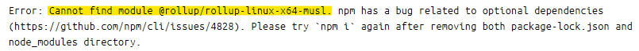

= FarmLand
:icons: font
:toc: macro
:toclevels: 3
:sectnums:

//image::frontend/public/farmland_logo.png[,100]

FarmLand is a web application that encourages farmers' digital transition by allowing them to easily manage their animal stocks.
Thanks to FarmLand, farmers can create their own account and manage their animal stocks from any device.

toc::[]

== Structure

FarmLand is made from multiple components.

The backend of the app supports a microservice-based architecture.

* `frontend/`: the frontend app using https://angular.dev[Angular]
* `backend/`: the microservices implementing the backend of the app
** `user-service/`: the user microservice (users and authentication) using https://expressjs.com/[Express] and https://sequelize.org/[Sequelize] (database ORM)
** `farm-service/`: the farm microservice (animal stocks) using https://expressjs.com/[Express] and https://sequelize.org/[Sequelize] (database ORM)
** `api_gateway/`: a gateway managing redirections between the frontend and the backend microservices, using https://expressjs.com/[Express] and https://www.npmjs.com/package/http-proxy-middleware[http-proxy-middleware] (experimental)

== Installation and prerequisites

FarmLand is based on a Node.js and PostgreSQL environment.

=== Dependency installation

. Install the latest version of https://nodejs.org/[Node.js]
. Run the following command in a command prompt at the project root to install dependencies for each component:
+
[source,bash]
----
npm i
----
. Install the latest version of https://www.docker.com/[Docker] to easily run the app

=== Environment files

`.env.dev` files must be added at the root of both the link:backend/user-service/[user microservice] and the link:backend/farm-service/[farm microservice] directories. Those files can be created from the already provided `.env` files (those must not be modified).

Provide values for each of the environment variables defined in the created `.env.dev` files. Use the values defined in the `docker-commpose.yml` files related to the microservices if the application is meant to be launched via <<docker,Docker containers>>.

== Running via Docker [[docker]]

Each component of the app provides a `Dockerfile` and a `docker-compose.yml` file to separately run them inside Docker containers.

=== Create the app network

Although each component can be run separately inside Docker containers, they all communicate via a Docker network.

Create the `farmland_network` by running the following command inside a command prompt:

[source, bash]
----
docker network create farmland_network
----

=== Launch Docker containers

==== Launch a single container

Run the following command in a command prompt at the root of any component to separately run it inside a Docker container:

[source,bash]
----
docker-compose up -d --build
----

[WARNING]
====
The following error may occur when running the Angular frontend app container:

If that's the case, try to run the following command https://docs.docker.com/reference/cli/docker/container/exec/[inside the corresponding container]:

[source, bash]
----
npm i
----

Then rerun the container.

====

==== Launch all containers

Run the following commands in a command prompt at the project root to run all components at once inside Docker containers:

[source,bash]
----
cd frontend
docker-compose -p farmland_frontend up -d --build

cd ../backend/user-service
docker-compose -p farmland_user_backend up -d --build

cd ../farm-service
docker-compose -p farmland_farm_backend up -d --build

cd ../api-gateway
docker-compose -p farmland_api_gateway up -d --build
----

NOTE: https://docs.docker.com/desktop/[Docker Desktop] can be downloaded to more easily manage Docker containers.

==== Access containers

Each component can be accessed at the following addresses:

* Main app (gateway): http://localhost:3000
* Frontend (Angular app): http://localhost:4200
* Backend:
** User backend:
*** User API: http://localhost:3001
*** User database: http://localhost:5432
*** pgAdmin interface to manage user database: http://localhost:8888
** Farm backend:
*** Farm API: http://localhost:3002
*** Farm database: http://localhost:5431
*** pgAdmin interface to manage farm database: http://localhost:8887

NOTE: When launched, a container may take a few moments to initialize before being accessible from its address.

=== Run database seeders

Scripts are provided to populate the user and the farm databases with fake data for quick testing.

Run the following command inside the `src/` folder inside the Docker container running the user backend microservice to populate the user database:

[source, bash]
-----
node -r ts-node/register --env-file=../.env.dev seedUsers.ts
-----

Do the same with the following command inside the Docker container running the farm backend microservice, to populate the farm database:

[source, bash]
-----
node -r ts-node/register --env-file=../.env.dev seedAnimals.ts
-----

== Code linting

The project has been set up with https://typicode.github.io/husky/[Husky] and https://eslint.org/[ESLint] so the TypeScript files are automatically linted before a commit is created. Linting is configured with basic rules, but more parameters could be defined to further ensure the quality of the pushed code.