= FarmLand 2.0
:icons: font
:toc: macro
:toclevels: 3
:toc-title: Table des matières
:sectnums:

FarmLand (2.0) est une application web encourageant la transition numérique auprès des fermiers en proposant une solution clé en main facilitant la gestion de stocks d’animaux et de matériel.

====

Onglet / fichier link:README.adoc[] : informations et spécificités relatives au projet FarmLand 2.0 (structure, installations et prérequis, lancement, etc)

Onglet / fichier link:CONTRIBUTING.adoc[] : informations et processus à respecter pour contribuer au projet à partir de ce repository GitHub (stratégies de branches, workflows, etc)

Onglet / fichier link:GOVERNANCE.adoc[] : informations relatives à la gestion de ce repository GitHub (storymap, board, etc)

====

toc::[]

== FarmLand
La plateforme FarmLand permet aux agriculteurs de créer facilement un compte et de suivre en temps réel, leurs stocks d’animaux et de matériels à partir de n’importe quel appareil (ordinateur, tablette ou smartphone). Dans sa version 2.0, l'application offre également la possibilité de connecter des outils de recensement tels que des scanners, détecteurs ou compteurs automatiques pour faciliter le processus de comptage auprès des fermiers.

=== FarmLand 1.0
Une première version de FarmLand a déjà été développée afin de poser les fondations du projet et de valider les besoins essentiels du terrain. Cette version initiale se concentre sur un périmètre fonctionnel restreint, intégrant les fonctionnalités de base suivantes :

* *L’authentification* : Un compte fermier peut être créé via la page dédiée à gauche. Les utilisateurs disposant d’un compte fermier peuvent se connecter avec leur adresse email et leur mot de passe à droite.

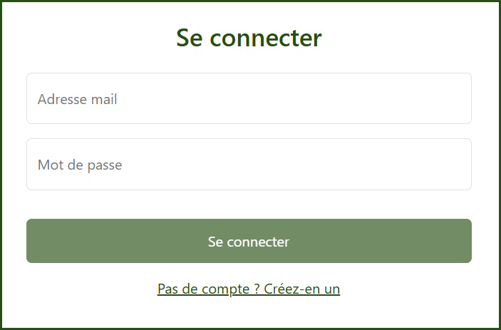

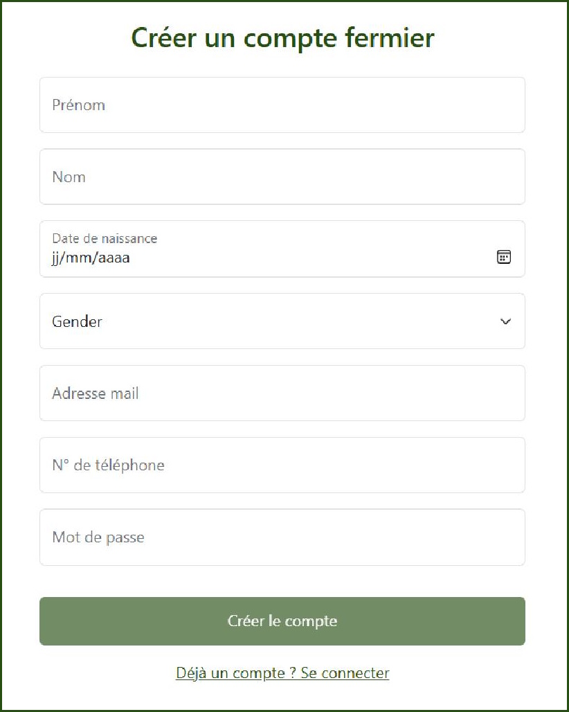

* *La gestion de stocks d’animaux* : Une fois connecté, la page de gestion de stocks d’animaux permet aux fermiers de consulter la liste complète de ses stocks d’animaux, d’ajouter, de modifier ou de supprimer les stocks d’animaux.

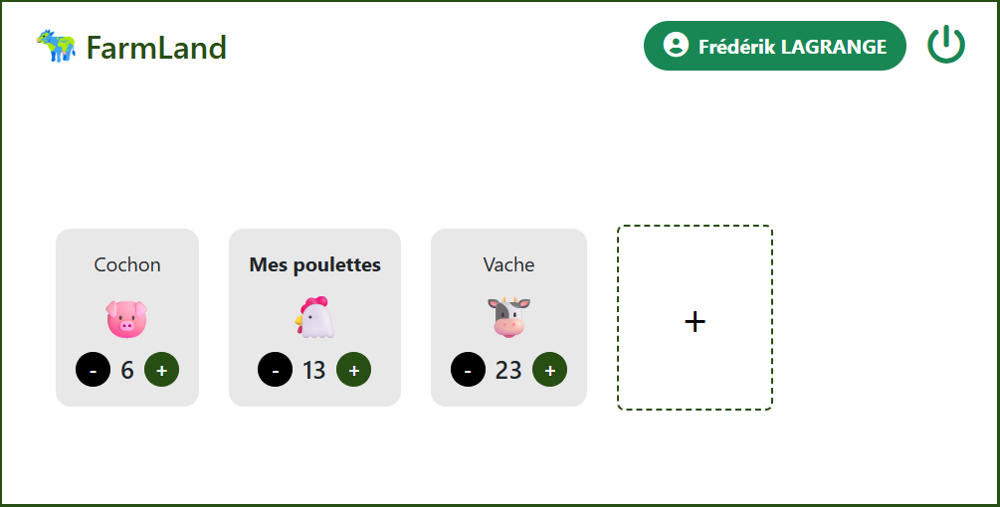

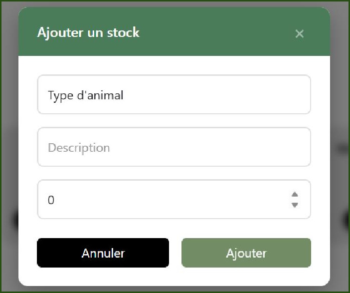

== Structure

L'application existante est basée sur une architecture micro-services :

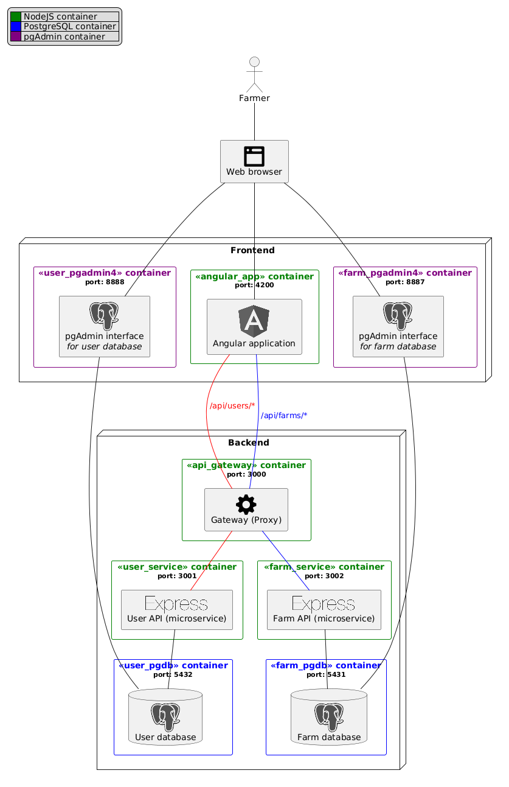

* `frontend/`: interface frontend basée sur https://angular.dev[Angular]
* `backend/`: micro-services backend
** `user-service/`: micro-service de gestion des utilisateurs (et de l'authentification) basé sur https://expressjs.com/[Express] et https://sequelize.org/[Sequelize] (database ORM)
** `farm-service/`: micro-service de gestion des fermes basé sur https://expressjs.com/[Express] et https://sequelize.org/[Sequelize] (ORM base de données)
** `api_gateway/`: serveur proxy gérant les redirections entre l'interface frontend et les micro-services backend, basé sur https://expressjs.com/[Express] et https://www.npmjs.com/package/http-proxy-middleware[http-proxy-middleware] (experimental)

== Installation et prérequis

FarmLand se base sur un environnement Node.js et PostgreSQL.

=== Installer les dépendances

. Installer la dernière version de https://nodejs.org/[Node.js]
. Exécuter la commande suivante dans un terminal à la racine du projet pour installer les dépendances de chaque composant de l'application :
+
[source,bash]
----
npm i
----
. Installer la dernière version de https://www.docker.com/[Docker] pour faciliter le lancement de l'application

=== Créer les fichiers d'environnement [[env_files]]

Des fichiers `.env` doivent être ajoutés à la racine du dossier des micro-services de gestion des link:backend/user-service/[utilisateurs], des link:backend/farm-service/[fermes] et du link:backend/api-gateway/[service de proxy]. Ces fichiers peuvent être créés à partir des fichiers `.env.template` existant (à ne pas modifier) à ces mêmes emplacements.

Renseigner des valeurs pour chaque variable d'environnement définie dans les fichiers `.env`. Utiliser les valeurs définies dans les fichiers `docker-compose.yml` rattachés aux micro-services si l'application est lancée dans des <<docker,conteneurs Docker>>.

== Lancement via NPM

Les composants de l'application peuvent être lancés individuellement via des commandes NPM.

WARNING: Seules les application frontend et backend peuvent être lancées via des commandes NPM, il sera nécessaire de trouver un hébergeur local pour les bases de données ainsi qu'un SGBDR adapté.

=== Compléter les fichiers d'environnement

Une fois les <<env_files, fichiers environnement créés>>, ils peuvent être complétés en suivant les exemples ci-dessous.

Exemple de fichier `.env` pour le micro-service des utilisateurs :

[source, bash]
----
JWT_SECRET=3fe11527-2b75-4c09-abbf-9b9fd3530023
DB_HOST=localhost
DB_PORT=5432
DB_USER=farmland
DB_PASSWORD=strongherve
DB_NAME=userdb
----

Exemple de fichier `.env` pour le micro-service des fermes :

[source, bash]
----
DB_HOST=localhost
DB_PORT=5431
DB_USER=farm
DB_PASSWORD=cock
DB_NAME=farmdb
USER_SERVICE_URL=http://localhost:3001
----

Exemple de fichier `.env` pour le service du proxy :

[source, bash]
----
USER_SERVICE_URL=http://localhost:3001
FARM_SERVICE_URL=http://localhost:3002
FRONTEND_URL=http://localhost:4200
----

=== Lancer l'interface frontend
Exécuter la commande suivante link:frontend/[à la racine du projet de l'interface frontend] pour lancer ce dernier :

[source, bash]
----
npm start
----

=== Lancer l'API utilisateur
Exécuter la commande suivante link:backend/user-service/[à la racine du projet du backend utilisateur] pour lancer ce dernier :

[source, bash]
----
npm run dev
----

=== Lancer l'API ferme
Exécuter la commande suivante link:backend/farm-service/[à la racine du projet du backend ferme] pour lancer ce dernier :

[source, bash]
----
npm run dev
----

=== Lancer le serveur proxy
Exécuter la commande suivante link:backend/api-gateway/[à la racine du projet du serveur proxi] pour lancer ce dernier :

[source, bash]
----
npm run dev
----

== Lancement via Docker [[docker]]

Chaque composant de l'application est rattaché à des fichiers `Dockerfile` et `docker-compose.yml` permettant de les lancer dans des conteneurs Docker distincts.

=== Compléter les fichiers d'environnement

Une fois les <<env_files,fichiers environnement créés>>, ils peuvent être complétés en suivant les exemples ci-dessous.

Exemple de fichier `.env` pour le micro-service des utilisateurs :

[source, bash]
----
JWT_SECRET=3fe11527-2b75-4c09-abbf-9b9fd3530023
DB_HOST=user_db
DB_PORT=5432
DB_USER=farmland
DB_PASSWORD=strongherve
DB_NAME=userdb
----

Exemple de fichier `.env` pour le micro-service des fermes :

[source, bash]
----
DB_HOST=farm_db
DB_PORT=5431
DB_USER=farm
DB_PASSWORD=cock
DB_NAME=farmdb
USER_SERVICE_URL=http://user_service:3001
----

Exemple de fichier `.env` pour le service du proxy :

[source, bash]
----
USER_SERVICE_URL=http://user_service:3001
FARM_SERVICE_URL=http://farm_service:3002
FRONTEND_URL=http://angular_app:4200
----

=== Créer le réseau Docker de l'application

Bien que chaque composant puisse être lancé séparément dans un conteneur Docker, pour communiquer entre eux, un réseau Docker doit être créé.

Créer le réseau `farmland_network` en lançant la commande suivante dans un terminal :

[source, bash]
----
docker network create farmland_network
----

=== Lancer les conteneurs Docker

*Une fois les dépendances de tous les projets installées*, exécuter la commande suivante dans un terminal à la racine du projet pour lancer tous les composants de l'application à l'intérieur de conteneurs Docker :

[source,bash]
----
cd frontend
docker-compose -p farmland_frontend up -d --build

cd ../backend/user-service
docker-compose -p farmland_user_backend up -d --build

cd ../farm-service
docker-compose -p farmland_farm_backend up -d --build

cd ../api-gateway
docker-compose -p farmland_api_gateway up -d --build
----

NOTE: https://docs.docker.com/desktop/[Docker Desktop] peut être téléchargé pour gérer plus facilement les conteneurs Docker créés.

[WARNING]
====
L'erreur suivante peut apparaitre en lancer l'interface frontend Angular dans un conteneur :

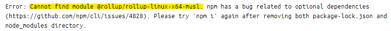

Si cela arrive, essayer de lancer la commande suivante https://docs.docker.com/reference/cli/docker/container/exec/[à l'intérieur du conteneur correspondant] :

[source, bash]
----
npm i
----

Relancer après coup le conteneur.

====

=== Accéder aux conteneurs

Chaque composant de l'application peut être accédées à partir des adresses suivantes :

* Application principale : http://localhost:3000
* Interface frontend : http://localhost:4200
* Backend:
** Backend utilisateur :
*** API utilisateur : http://localhost:3001
*** Base de données utilisateur : http://localhost:5432
*** Interface pgAdmin de gestion de la base de données utilisateur: http://localhost:8888
** Backend ferme :
*** API ferme : http://localhost:3002
*** Base de données ferme : http://localhost:5431
*** Interface pgAdmin de gestion de la base de données ferme : http://localhost:8887

Si l'application est lancée dans l'environnement Docker configuré, *reprendre les données de connexion définies dans les fichiers `docker-compose.yml`* pour accéder aux bases de données et aux interfaces pgAdmin.

NOTE: Une fois lancé, un conteneur peut prendre quelques instants à s'initialiser avant d'être accessible à l'adresse correspondante.

== Application des migrations

Une fois les bases de données des services de gestion des utilisateurs et des fermes créées, leurs structures respectives peuvent être montées en appliquant les dernières migrations disponibles.

Pour cela, exécuter la commande suivante à la racine des deux projets :

[source, bash]
----
npx sequelize-cli db:migrate
----

== Remplissage des bases de données

Des scripts sont mis à disposition pour populer les bases de données de gestion des utilisateurs et des fermes avec des données factices afin d'effectuer des tests rapides.

Pour cela, exécuter la commande suivante à la racine des projets des services de gestion des utilisateurs et de fermes :

[source, bash]
----
npx sequelize-cli db:seed:all
----

== Gestion des erreurs

Une gestion des erreurs a été mis en place dans le frontend et le backend de l'application afin d'assurer la continuité des services en cas de pépin.

=== Côté interface

Du côté de l'interface de l'application les erreurs doivent être affichées de manière compréhensible et à titre indicatif pour les utilisateurs. Plusieurs affichages sont possibles en fonction des erreurs rencontrées :

* *Erreurs backend :* Les erreurs renvoyées du backend sont attrapées et des messages sont affichés en conséquence afin d'informer plus convenablement l'utilisateur.
+
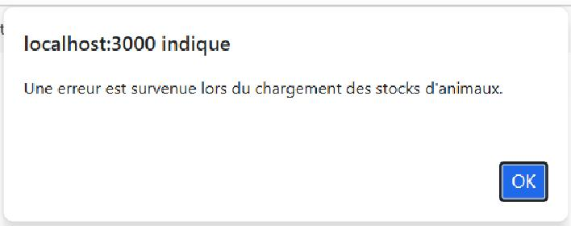
* *Erreurs globales :* Si une erreur inattendue se produit dans l'un des composants Angular de l'application, qu'elle n'est pas gérée et remonte toute la pile d'exécution, alors un message d'erreur sera affiché et l'application restera dans un état stable et utilisable.
+
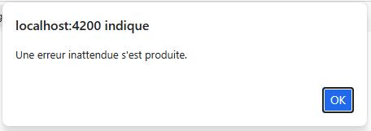
* Erreurs 404 : Si aucune page ne correspond à l'URL saisie, une erreur 404 se produit et l'utilisateur est redirigé vers une page dédiée.
+
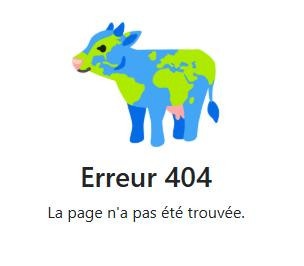

=== Côté API

==== Erreurs backend

Du côté de l'API backend, plusieurs logiques d'erreurs sont prises en compte :

* *Connexion à la base de données :* Lors du démarrage des services de gestion des utilisateurs ou des fermes, si la connexion à la base de données correspondante a échoué, une erreur (ainsi que la trace complète de l'erreur) sera affichée dans la console.
+

* *Logique métier :* Les routes de l'API implémentant les logiques métiers pour la gestion des utilisateurs et des fermes peuvent renvoyer des erreurs HTTP si certaines logiques ne sont pas respectées lors de l'utilisation des routes (utilisateur non connecté, ressource non autorisée, donnée non trouvée, etc)
+
NOTE: Les codes d'erreur correspondant à chaque route de chaque service de l'API sont détaillés dans les <<swagger, documentations Swagger>> correspondantes.
* *Erreur route :* Si l'API rencontre une erreur quelconque durant le traitement d'une requête, un code d'erreur HTTP 500 sera retournée avec le message de l'erreur correspondant.

==== Logging des erreurs

Pour chaque micro-service backend, les erreurs renvoyées sont enregistrées dans un fichier `log.txt` automatiquement créé à la racine du projet correspondant.

Si un micro-service est marqué comme étant lancé dans un environnement de développement en mettant la valeur du paramètre `environment` à `developement` dans le fichier `package.json` à la racine du projet correspondant, alors les logs enregistreront des traces d'erreurs de code complète pour faciliter de débogage.

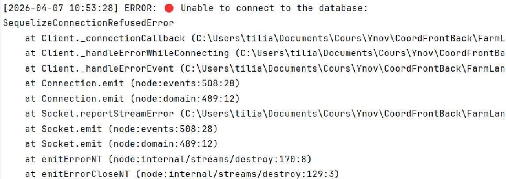

En revanche, si le micro-service est marqué comme étant lancé dans un environnement de production en mettant la paramètre d'environnement à `production`, alors les logs n'enregistreront que des messages d'erreurs classiques à titre indicatif.

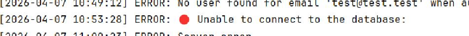

=== Codes d'erreurs HTTP

Tous les codes d'erreur HTTP sont référencés et expliqués https://developer.mozilla.org/en-US/docs/Web/HTTP/Reference/Status[ici].

== Documentation et tests

=== Interface Storybook

https://storybook.js.org/[Storybook] a été ajouté au projet frontend de l'application afin de documenter et de faciliter le test les différents composants Angular implémentés.

Exécuter la commande suivante à la racine du projet frontend pour lancer l'interface Storybook :

[source, bash]
----
npm run storybook
----

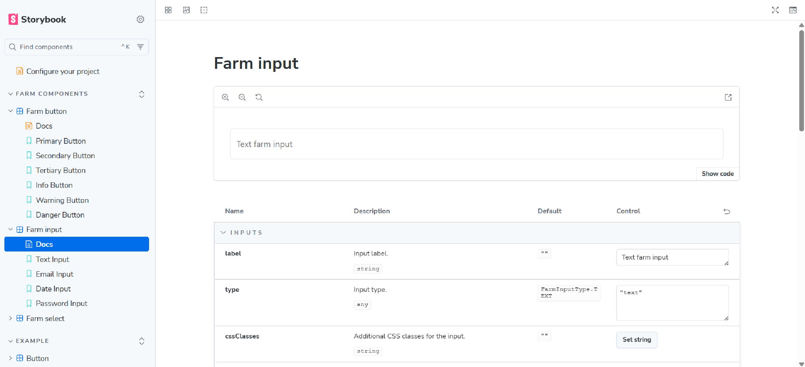

=== Interface Swagger [[swagger]]

https://swagger.io/[Swagger] a été ajouté aux projets backend de gestion des utilisateurs et des fermes afin de documenter et de faciliter le test des différentes routes implémentées.

La page Swagger de l'API des utilisateurs peut être accédée à l'adresse http://localhost:3001/docs et celle de l'API des fermes à l'adresse http://localhost:3002/docs.

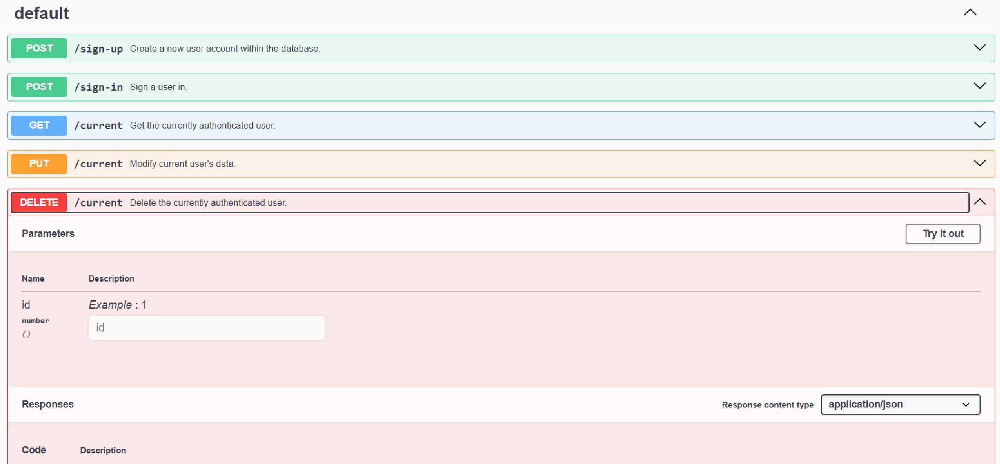